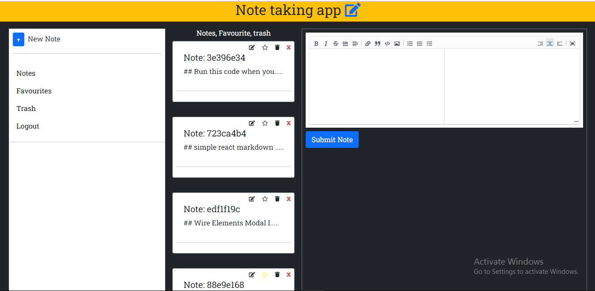
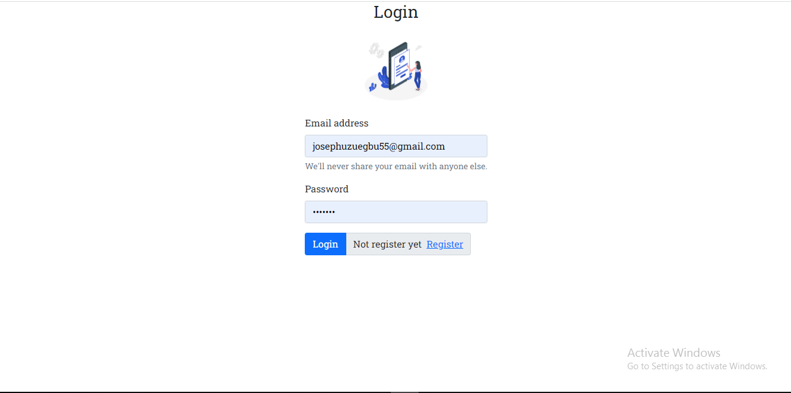
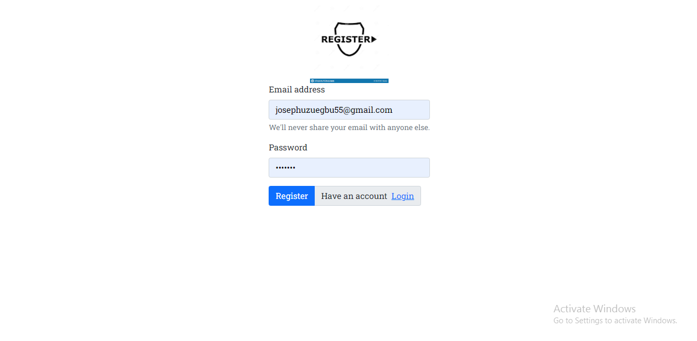

## Note taking app

### Introduction:
Note-taking app is an app that keeps record and allows jotting of notes. It utilizes browser storage Api for data storage.
It is an app that allows you create NOTES with ease and it gives tou the freedomn to EDIT, DELETE, TRASH any  NOTES is created. 

## Preview

### sample 1:

<!-- {process.env.PUBLIC_URL + '/yourPathHere.jpg'} -->
### sample 2:

### sample 3:
